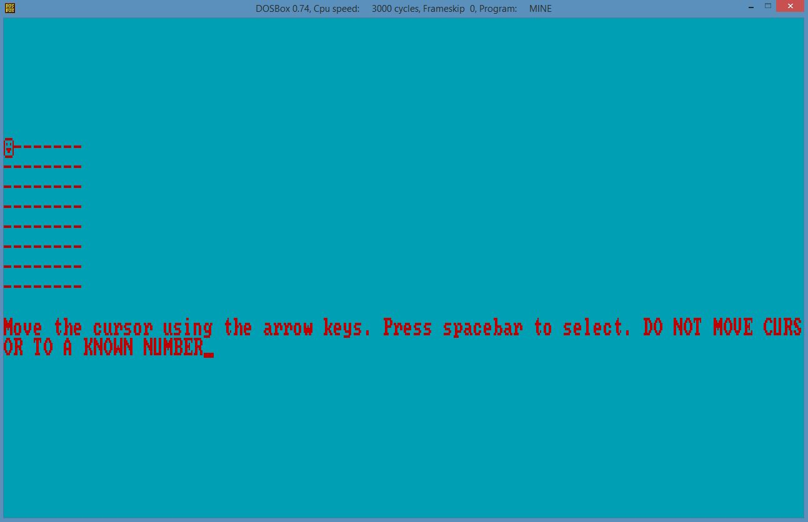
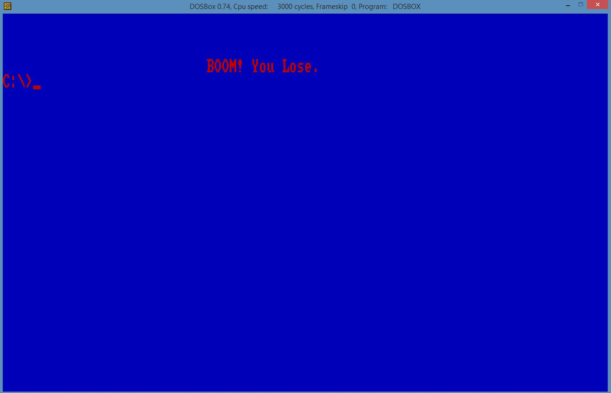
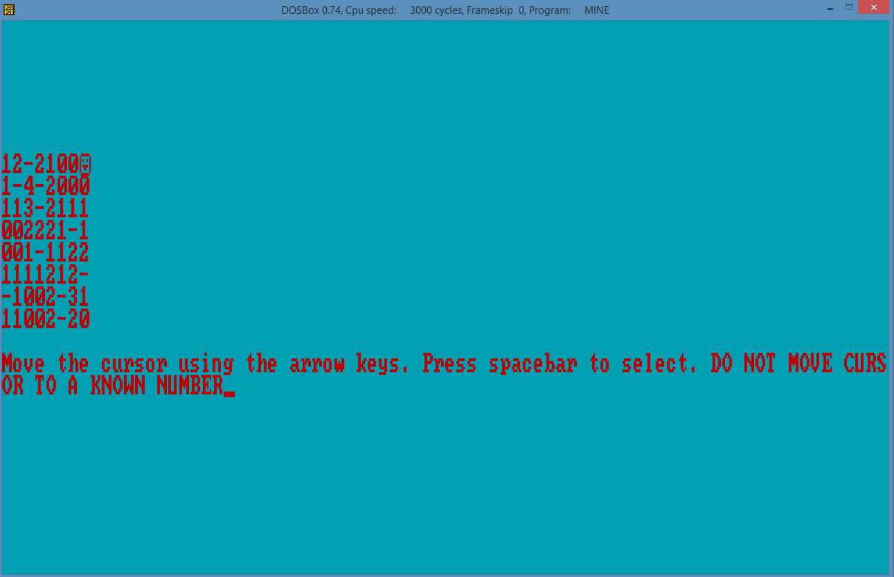
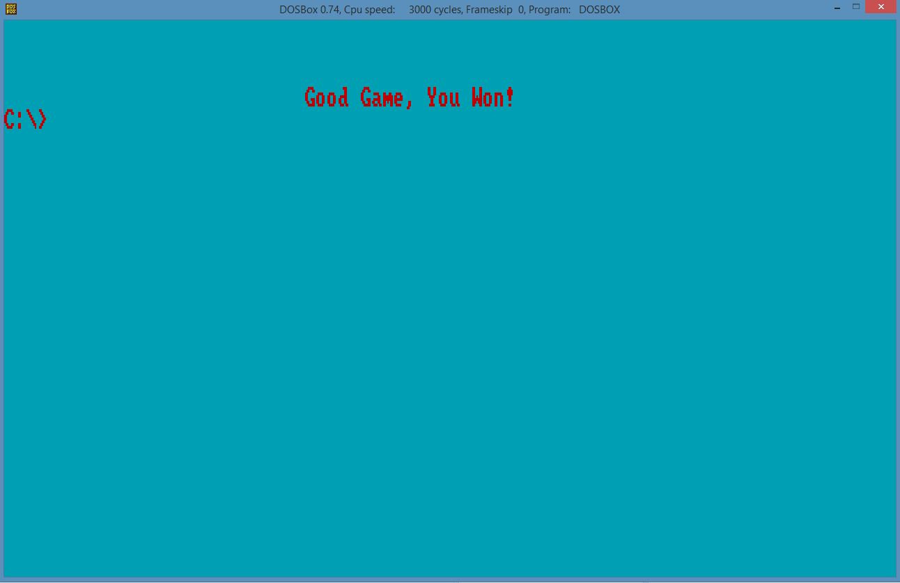

## Minesweeper
Project for CSC 210 - Assembler Programming with Michael Vulis at the City College of New York.
## About The Project
- Use assembly language 16-bit tasm to create minesweeper.
- Run the application using DOSbox.
## Additional Information
- Mine.ASM is the asm file with the minesweeper code in it.
- Typing "tasm Mine.ASM" gets the .OBJ and .MAP file.
- After getting the .OBJ file, type "tlink Mine.OBJ" to get the .exe file.
- Run the Mine.exe file by typing "Mine.exe". If it fails, close DOSBox and open it again and run Mine.exe again. It should work again.
- Play the game by moving the arrow keys and spacebar to select.
- When moving the cursor, make sure not to move it to a location where a number is already shown.
## Using the Application
### Starting The Game

### Losing The Game

### Playing The Game

### Winning The Game

## Ask me about anything
If there are any questions, feel free to ask them [here](https://github.com/ChibiKev/Minesweeper/issues).